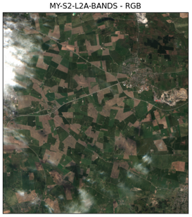
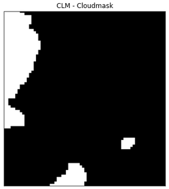

# Feature Importance and Harvest Prediction in Agriculture 

<h6>Fig. Overview of fields to be analyzed. Heddinge, Sweden 2019. </h6>

### Combining Sentinel 2 (all bands + computed indexes), slope images, soil, field, weather to predict harvest. 

The end result of these algorithms is to a) predict harvest and b) extract importance of the input features (via SHAP) used towards that prediction. A coorelation matrix for features used is also computated. The training is based on decision trees currently. 

The approach followed, has been tested and is general enough to be possible to apply world-wide when just the Sentinel 2 is used. In Sweden we have the extra benefit of the actual data from farmers which further localized information about soil and harvest conditions.

The input vector construction is based on farmer data provided/collected related to soil, field info and harvest. The current version of the files requires the user to choose a crop  (e.g. Hostvete) for all fields in a user chosen region (i.e. Heddinge). The data timeframe starts at seeding the year before and ends at harvest for a given year. Data is also included from a relevant slope.tiff image as well as all 13 bands from Sentinel 2 over the same exact time frame.
This file should run 4th after running all the files listed below.

In the current version of the file we load all soil, field, year and weather data for all fields in Heddinge and predict the harvest for Hostvete for these field during a single year for which we are provided with data. The data we had included any of the years: 2017, 2018, 2019 or 2020. In this particular version of the algorithm we categorize the harvest data - this however is not necessary. Since we are interested to predict harvest then it would be good to see what is the distribution of the item we are trying to predict. The hostvete harvest data in this example has a distribution which can be seen below (for 2019).

<h7>Fig. Harvest distribution for Hostvete for fields in Heddinge, Sweden 2019. Horizontal axis is showing production of hostvete. Vertical axis is showing how many locations (input locations in our region of interest) produced that much hostvete. We see for instance that some (very few) fields produced as much as 16 hostvete. </h7>

With the above input requirements, the actual run time which includes loading and processing all data as well as training can be 1 hour for a region like Heddinge. That time estimate includes running all 4 files (see below) needed for the data processing. The training time itself is fast and may be as little at 2 minutes (in a 56 core machine - Intel® Xeon(R) CPU E5-2697 v3 @ 2.60GHz × 56) due to the parallel processing.

The dates used in the current implementation of the algorithm begin at seed data (the year before) until harvest date. 
Thus weather grouping is performed based on the seasons which begin from seed date -> 1st Nov year before + 15 March -> midsummer + midsummer -> max harvest date.
Currently the code allows the used to choose to group the above automatically to daily, weekly, monthly or seasonal grouping in the final input vector. This is achieved simply by changing the hyperparameters to, respectively, "d", "w", "m" or "s". Instructions are included in the file.

Cloud cleaning is also performed and linear interpolation is used when clouds made the data not possible to use in the case of the Sentinel 2 data.

  
   

<h6>Fig. Cloud cover example (RGB bands). Cloud mask computed for later processing of the same image as above. Heddinge, Sweden. </h6>

The above time and spatial data specifications can easily be extended to much larger regions or much larger timeframes. In previous versions of the file I tested a time frame of 4 years for a specific crop (instead of the current implementation of one year) with comparable results in terms of accuracy of prediction.  Clearly the overall time to upload and process the algorithm increased linearly with the number of data (training was very fast).

## Order of files to be run for processing the data and subsequent training

Files must be run in the following order:

    1. storeSoilCenters.ipynb on AgricultureProject (AP) dir creates the centers.txt from soil data
    2. cut_out_bb.py on AP/Slope_Images/ creates 100s of npy files with bboxes of slope.tiff with side 2r
    3. downSent2.ipynb on eo-learn-master/examples/crop-type-classification creates eopatches of AOI and in particular respective npy files of 13 bands for that region over same timeframe (see dates below) as required in this file here.
    4. inpVecVPN_Sent2_Aug31.ipynb to import all the data, do the data clearning and training and finally produce the harvest prediction.

#### (Note: extensive descriptions are provided within each cell of the notebook files. So specific information of what is done can be found there.)

We now outline the work-flow for this project. 

We first need to produce bounding boxes around all the soil coordinates provided in the chosen region (e.g. Heddinge). This is done with file storeSoilCenters.ipynb. 

<h6>Fig. Sample of soil coordinates from Heddinge, Sweden. </h6>

The resulting file of soil coordinate centers is then used by the file cut_out_bb.py to cut out small bounding boxes from the image file slope.tiff. All these bounding boxes are stored in individual numpy arrays for later processing. 

<h6>Fig. Pixel values from the slope.tiff file for a random bounding box cut-out. </h6>

<h6>Fig. Pixel image from the slope.tiff file of a random bounding box cut-out. </h6>

Clearly based on the above idea any other file can be included and processed in the dame way in order to later be a part of the input vector used in training (see later below).

Then file 3, downSent2.ipynb is run in order to download Sentinel 2 data from the region of interest which are then stored in newly created subdirectories for later processing. 

<h6>Example of one of the 10 downloaded bands from Sentinel 2. This is band 9 for the Heddinge fields, Sweden 2019. </h6>

<h6>Fig. Some of the indexes computed. In this example we present mean NDVI over all time requested from Sentinel 2 in order to observe any spatial changes in NDVI for the Heddinge fields, Sweden 2019. </h6>

Finaly file 4, inpVecVPN_Sent2_Aug31.ipynb is run which does all the data processing and eventual training. Specifically it: 
a) reads the previously created file centers.txt based on the soil coordinates and uploads the corresponding slope data as numpy arrays (i.e. the bounding boxes cut out of the slope.tiff image - see above) and creates a feature in our input vector; 
b) reads in all the soil, harvest, field and weather data via VPN from t-kartor service; 

<h6>Fig. Soil and harvest data happen to not coinside in general. Heddinge fields, Sweden. </h6>

<h6>Fig. So we removed any such data that was too far away from each other. After clean up we therefore obtain the figure above for the Heddinge fields. </h6>

c) processes all data from part b to extract spatial and temporal features and stores them into the input vector dataframe; 
d) loads the images and bands already stored into the subdirectories 
e) processes these and extract spatial and temporal features which are also stored into the input vector dataframe. 

<h6>Fig. During processing we also observe the NDVI averaged over space for each time point. To fill in the gaps from throwing out too clowdy data we perform linear Interpolation. </h6>

A coorelation matrix is also created between the input features.

<h6>Fig. Feature correlations. Note that in each feature s_ and the h_ indicates whether the data originaed from the soil database or the harvest database.</h6>

## Training Decision Trees

Once all of the input vector dataframe has been built the training starts. This is done with decision trees using a k-fold method. As you will see in the files a gradient boosting method is mainly implemented. A number of classic ML metrics are also computed,

<h6>Fig. Metrics computed show good accuracy for several categories. The average F1 was 82% for this data. </h6>

## Feature Importance

Feature importance comparisons are now performed.

<h6>Fig. Feature importance. Note: "B" indicates band, "NORM" and "NDVI" or "NDWI" are the indexes computed. Also note that each feature indicates which date it originated from. </h6>

Subsequently SHAP importance values are produced and a mean absolute SHAP values is computed among some 260 features.

<h6>Fig. SHAP value. </h6>

<h6>Fig. Mean Absolute of SHAP. </h6>

## This is work in progress.... so still more to come :) 
